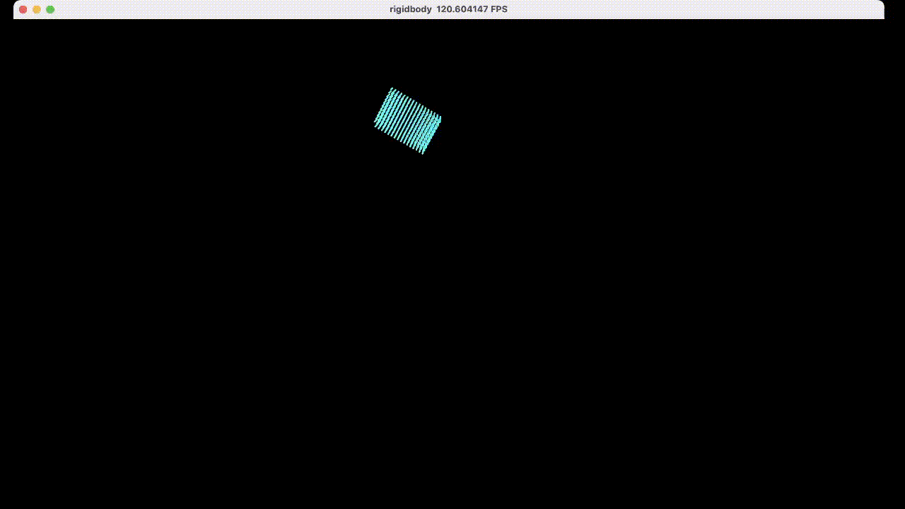

# Demo


# How to run
First, intall latest taichi by
```python
pip install taichi
```

Then, run with
```python
python tiRigidBody.py
```
Rember to press SPACE to start the simulation

# How to play with it
## Hotkeys
1. Press SPACE to start or pause
2. "wasd" for moving the camera
3. When paused, press "p" to procceed only one step(useful for debugging)

## Try different parameters
1. Try to change the parameters in "init_particles()" (like init_pos, cube size etc.) or the num_particles
2. Try to give another angle to the "rotation()"
3. Try to change the stiffness of penalty force in "collision_response()"

## Switch the branches
The different branches record the progress of coding.
Start with the simplest case, and gradually add features
1. minimal_ggui:  show two static particles in the screen
2. init_particles: neatly stacked particles to form a box
3. translation: move the box
4. rotation: rotate the box
5. collision_one_particle: colliding with a ramp, the collided particles are dyed to red
6. bounce: the box can drop and rebounce, but no rotation
7. master: the main branch

## Add more features
1. Add more boundary walls (now there is only a ground)
2. Try to give better collision_reponse (more complex penalty forces or better)
3. Try to add collision detection for collision with complex geometries
4. Try to add more rigid bodies, and make them collide with each other


# Want to understand the theory?
see: 
- Matthias Müller, Bruno Heidelberger, Matthias Teschner, and Markus Gross. 2005. Meshless deformations based on shape matching. ACM Trans. Graph. 24, 3 (July 2005), 471–478. [https://doi.org/10.1145/1073204.1073216](https://doi.org/10.1145/1073204.1073216)
- GAMES103 Course, by Huamin Wang. [https://games-cn.org/games103/](https://games-cn.org/games103/)

近期我会录个视频到B站从头讲解原理和实现方法。图文版也会放到博客里。